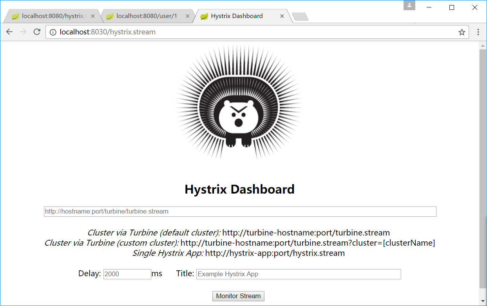
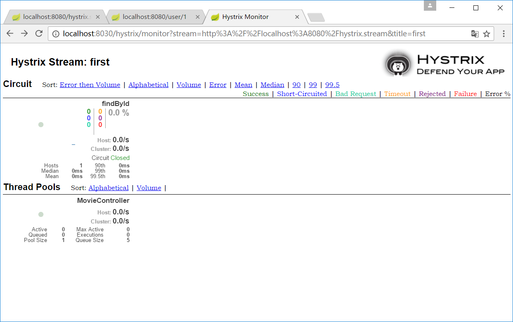

title: hystrix 监控
---
除了实现容错外，hystrix 还提供了近乎实时的监控。HystrixCommand 和 HystrixObservableCommand
在执行时，会生成执行结果和运行指标，比如每秒执行的请求数成功数等，这些监控数据对
分析应用系统的状态很有用。

spring-cloud-starter-netflix-hystrix 已经包含了hystrix-metrics-event-stream 模块，该模块可将
监控的指标信息以text/event-stream 的格式暴露给外部系统。在此基础上，只需为项目添加
spring-boot-starter-actuator,就可使用 /hystrix.stream 端点获取
hystrix的监控信息了。
## 通过端点获取监控数据
### 改造
 1. 复制 hystrix-logger的 consumer-movie 模块，修改模块名为 hystrix-consumer-movie-turbine,在pom
    文件加上 spring-boot-starter-actuator 依赖
### 测试
 1. 启动 simple 工程的 provider-user 和 Eureka-server 
 2. 启动 本工程  hystrix-consumer-movie-turbine
 3. 打开 http://localhost:8080/hystrix.stream,可看到浏览器一直处于请求的状
    态，可页面空白
 4. 访问 http://localhost:8080/user/1 后，再次访问 http://localhost:8080/hystrix.stream，
    可看到页面出现大量监控数据
    
## 使用 Hystrix Dashboard 可视化监控数据
可使用 Hystrix Dashboard ,图形化监控数据
### 改造
 1. 创建一个maven模块 hystrix-dashboard,并为模块添加如下依赖：
    ~~~xml
    <dependency>
        <groupId>org.springframework.cloud</groupId>
        <artifactId>spring-cloud-starter-netflix-hystrix-dashboard</artifactId>
    </dependency>
    ~~~
 2. 编写启动类，在启动类上添加 @EnableHystrixDashboard
    ~~~java
    @SpringBootApplication
    @EnableHystrixDashboard
    public class HystrixDashboardApplication {
        public static void main(String[] args) {
            SpringApplication.run(HystrixDashboardApplication.class,args);
        }
    }
    ~~~
 3. 在配置文件 application.yaml 添加 server.port=8030
### 测试
 1. 启动 hystrix-simple 的 provider-user 和 Eureka-server
 2. 启动 本工程  hystrix-consumer-movie-turbine
 3. 启动 hystrix-dashboard 
 4. 访问 http://localhost:8080/hystrix,可以看到 Hystrix Dashboard
    的主页。在URL一栏上输入 http://localhost:8080/hystrix.stream,
    随意设置一个title，单击 Monitor Sream 按钮后,即可看到如下界面
    
    
    
    
## 使用 turbine 聚合监控数据
### 改造
 1. 创建一个 maven 模块，artifactId 是 hystrix-turbine,并为模块添加如下依赖
    ~~~xml
    <dependency>
        <groupId>org.springframework.cloud</groupId>
        <artifactId>spring-cloud-starter-netflix-turbine</artifactId>
    </dependency>
    ~~~
 2. 在模块启动类上添加 @EnableTurbine注解
    ~~~java
    @SpringBootApplication
    @EnableTurbine
    public class Turbine {
    
        public static void main(String[] args) {
            SpringApplication.run(Turbine.class,args);
        }
    }
    ~~~
 3. 编写测试文件 application.yaml
    ~~~yaml
    server:
      port: 8035
    spring:
      application:
        name: hystrx-turbine
    eureka:
      client:
        register-with-eureka: false
        fetch-registry: false
        service-url:
          defaultZone: http://localhost/8761/eureka/
      instance:
        prefer-ip-address: true
    
    turbine:
      app-config: hystrix-consumer-movie
      cluster-name-expression: "'default'"
    ~~~
### 测试
 1. 启动 hystrix-simple 的 provider-user 和 Eureka-server
 2. 启动 hystrix-consumer-movie-turbine
 3. 启动 hystrix-stream-turbine
 4. 启动 hystrix-dashboard
 5. 访问 http://localhost:8080/user/1 产生监控数据
 6. 打开 Hystrix Dashboard 的首页 http://localhost:8031/hystrix.stream,在URL
    一栏上填入 http://localhost:8035/turbine.stream,随意指定一个title并单击 Monitor
    Stream 按钮后，出现监控数据

**turbine部分测试尚未通过** 
  