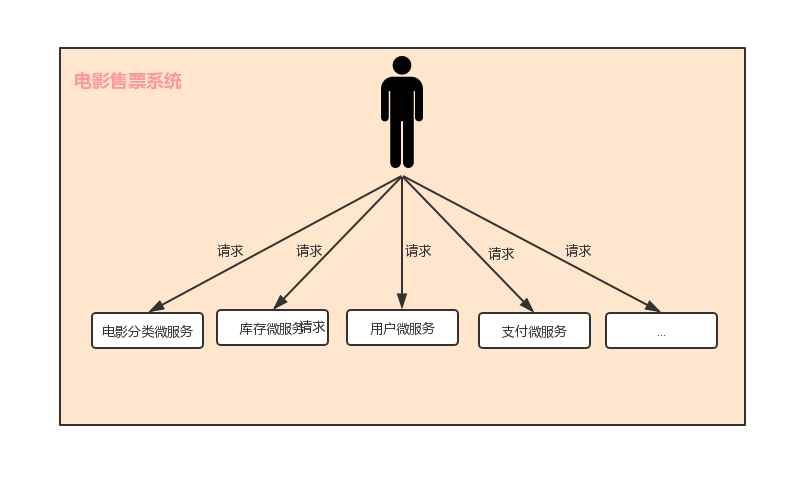
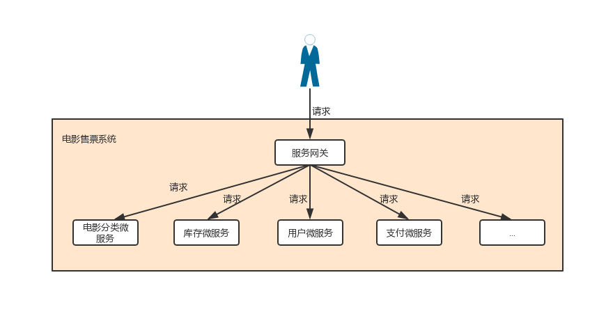

title: 使用zuul构建微服务网关

## 为什么使用微服务网关
经过前文的讲解，微服务架构已经初具雏形，但还有一些问题——不同的微服务
一般会有不同的网络地址，而外部客户端（例如手机app）可能需要调用多个服
务的接口才能完成一个业务需求。例如一个电影购票的APP,如下图：

如果让客户端直接与各个微服务通信，会有以下的问题：
 
  - 客户端会多次请求不同的微服务，增加了客户端的复杂性
  - 存在跨域请求，在一定场景下处理相对复杂
  - 认证复杂，每个服务都需要独立认证。
  - 难以重构，随着项目的迭代，可能需要重新划分微服务。如果
  客户端直接与微服务通信，那么重构将很难实施
  - 某些微服务可能使用了对防火墙、浏览器不友好的协议，直接访问时会有一定的困难。
  
以上问题可借助微服务网关解决。微服务网关是介于客户端和为服务端之间
的中间层，所有外部请求都会先经过微服务网关。使用微服务网关后，架构
可演变成下图

如上图所示，微服务网关封装了应用程序的内部结构，客户端只用跟网关交互，而无需
直接调用特定微服务的接口。这样，开发就可以得到简化。不仅如此，使用
微服务网关还有以下优点;

 - 易于监控。可以在微服务网关收集监控数据并将其推送到外部系统进行
 分析。
 - 易于认证。可在微服务网关上进行认证，然后再将请求转发到后端的微服务，
 而无需在每个微服务中进行认证。
 - 减少了客户端与各个微服务之间的交互次数
 
 ## Zuul 简介
 
 Zuul 是Netflix 开源的微服务网关，他可以和 Eureka,Ribbon，Hystrix等组件配合使用。
 Zuul和核心是一系列的过滤器，这些过滤器完成以下功能。
 
  - 身份认证与安全：识别每个资源的验证要求，并拒绝那些与要求不符的请求。
  - 审查与监控: 在边缘位置追踪有意义的数据和统计结果，从而带来精确的生产视图。
  - 动态路由：动态的将请求路由到不同的后端集群，
  - 压力测试：逐渐增加指向集群的流量，以了解性能
  - 负载分配：为每一种负载类型分配对应容量，并弃用超出限定值的请求
  - 静态响应处理：在边缘位置直接建立部分响应，从而避免其转发到内部集群。
  - 多区域弹性: 跨越 AWS Region 进行请求路由，旨在实现ELB(Elastic Load Balancing)
  使用的多样化，以及让系统的边缘更贴近系统的使用者。
  
## Zuul 饥饿加载
 我们知道，zuul 整合了 Ribbon 实现负载均衡，而 Ribbon 默认是懒加载的，可能导致请求较慢的问题，
 可使用如下配置配置饥饿加载
 ~~~yaml
 zuul:
  ribbon:
    eager-load:
      enabled: true
 ~~~
 
## Query String 编码
当处理请求时，query param 会被编码，因此，可在 Zuul 过滤器中进行一些适当的修改。
这些参数在 route 过滤器中构建请求时，将被重新编码。如果 query param 使用 JavaScript
的 encodeURIComponent() 方法进行编码，那么重新编码后的结果可能与原始值不同——尽管在
大多数情况下不会引起问题。但某些 Web 服务器可能会对复杂的 query string 进行编码。

要强制让 query string 与 HttpServletRequest.getQueryString() 保持一致，可使用如下配置：
    
    ~~~yaml
    zuul:
        forceOriginalQueryStringEncoding: true
    ~~~
 
 >- 该特殊标志只适用于 SimpleHostRoutingFilter,并且由于 query string 在原始的
 >HttpServletRequest 上获取，你将无法使用 RequestContext.getCurrentContext()
 >.setRequestQueryParams(someOverriddenParameters)重写query param。
 >
 >- forceOriginalQueryStringEncoding 处理的相关代码可详见 org.springframework.cloud.netflix
 >.zuul.filters.route.SimpleHostRoutingFilter#build-HttpRequest。
 
## 关于 Hystrix 隔离策略与线程池
### 隔离策略

 我们知道Zuul集成了 Hystrix,而 Hystrix 有隔离策略——THREAD 及 SEMAPHORE。默认情况下，Zuul 的
 Hystrix 的隔离策略是SEMAPHORE，可使用 `zuul.ribbon-isolation-strategy=thread` 将隔离策略
 改为 THREAD

### 线程池配置

当 `zuul.ribbon-isolation-strategy=thread` 时，Hystrix 的线程隔离策略讲作用于所有路由，
HystrixThreadPoolKey 默认为 RibbonCommand,这意味着，所有路由的 HystrixCommand 都会在
相同的 Hystrix 线程池中执行。

可使用如下配置，让每个路由使用独立的线程池：
    ~~~yaml
    zuul：
      threadPool:
        useSeparateThreadPools: true
    ~~~
 这样，HystrixThreadPoolKey 将与路由的服务标识相同。
 
 如果想为 HystrixThreadPoolKey 添加前缀，可使用雷士如下的配置：
 ~~~yaml
 zuul:
  threadPool:
    useSeparateThreadPools: true
    ThreadPoolKeyPrefix: prefix-
 ~~~
## Zuul 的高可用
 Zuul 的高可用非常关键，因为外部请求到后端微服务的流量都会经过 Zuul。故而在生产环境中一般都需要
 部署高可用的 Zuul 以避免单点故障
 
### Zuul 客户端也注册到了 Eureka Server 上

这种方式将 Zuul 客户端也注册到 Eureka Server 上，只需部署多个 Zuul 节点即可实现
其高可用。Zuul客户端会自动从 Eureka Server 中查询 Zuul Server 的列表，并使用 Ribbon 
如在均衡的请求 Zuul 集群

### Zuul 客户端未注册到 Eureka Server 上

现实中，这种场景往往更常见，例如，Zuul 客户端 是一个手机 App —— 不可能所有的手机终端都注册到
Eureka Server 上，这种情况下，可借助一个额外的负载均衡器来实现 Zuul 的高可用，例如：
Nginx、HAProxy、F5 等。

Zuul 客户端将请求发送到负载均衡器，负载均衡器将请求转发到其代理的其中一个 Zuul 节点。这样，就可以实现
Zuul 的高可用。

 