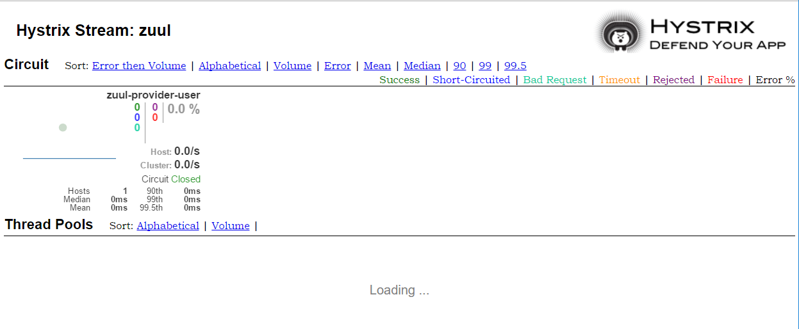

title:  Zuul 的容错与回退
---
## 改造
 
 1. 复制 zuul-simple 的 zuul-service ,ArtifactId 修改为 zuul-fallback
 
 2. 编写回退类
 
     ~~~java
     @Component
     public class MyFallbackProvider implements FallbackProvider {
     
         @Override
         public ClientHttpResponse fallbackResponse(Throwable cause) {
             if(cause instanceof HystrixTimeoutException){
                 return response(HttpStatus.INTERNAL_SERVER_ERROR);
             }else{
                 return this.fallbackResponse();
             }
         }
     
         @Override
         public String getRoute() {
             return "*";
         }
     
         @Override
         public ClientHttpResponse fallbackResponse() {
             return null;
         }
     
         private ClientHttpResponse response(final HttpStatus  status){
             return new ClientHttpResponse() {
                 @Override
                 public HttpStatus getStatusCode() throws IOException {
                     return status;
                 }
     
                 @Override
                 public int getRawStatusCode() throws IOException {
                     return status.value();
                 }
     
                 @Override
                 public String getStatusText() throws IOException {
                     return status.getReasonPhrase();
                 }
     
                 @Override
                 public void close() {
                 }
     
                 @Override
                 public InputStream getBody() throws IOException {
                     return new ByteArrayInputStream("服务不可用，请稍后再试".getBytes());
                 }
     
                 @Override
                 public HttpHeaders getHeaders() {
                     HttpHeaders headers = new HttpHeaders();
                     MediaType mt = new MediaType("application","json", Charset.forName("UTF-8"));
                     headers.setContentType(mt);
                     return  headers;
                 }
             };
         }
     }
     ~~~
## 测试
1. 启动 zuul-simple 的 zuul-eureka-server-simple，zuul-provider-user-simple
2. 启动 zuul-service-fallback
3. 启动 hystrix-turbine 的 hystrix-dashboard
4. 访问 http://localhost:8040/zuul-provider-user/user/1,可获得结果
5. 访问 http://localhost:8040/hystrix.stream,可获得 Hystrix 的监控数据
6. 访问 http://localhost:8030/hystrix,并在监控一栏填入 http://localhost:8040/hystrix.stream
    
    
    
7. 停掉 zuul-provider-user-simple，再次访问 http://localhost:8040/zuul-provider-user/user/1

    返回以下内容
        
        服务不可用，请稍后再试。
        